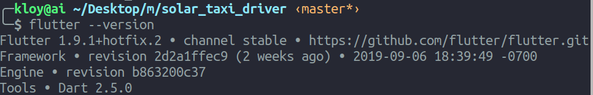
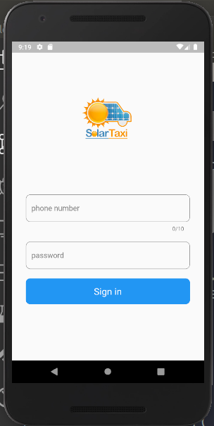

# solar_taxi_driver

The Solar Taxi Driver App was built to help the drivers who will be working at the Solar Taxi company use it to pick up passengers and others who want to use their service. It was one of the projects I worked on when I was interning at Kumasi Hive on June 3, 2019 to July 26, 2019.

I was built using:


## Solar Taxi Driver App 



## Getting Started

```bash
    git clone https://github.com/king-kloy/solar_taxi_driver.git

    cd solar_taxi_driver

    # start the android emulator
    # then run the application

    flutter run

```

A few resources to get you started if this is your first Flutter project:

- [Lab: Write your first Flutter app](https://flutter.dev/docs/get-started/codelab)
- [Cookbook: Useful Flutter samples](https://flutter.dev/docs/cookbook)

For help getting started with Flutter, view our 
[online documentation](https://flutter.dev/docs), which offers tutorials, 
samples, guidance on mobile development, and a full API reference.
